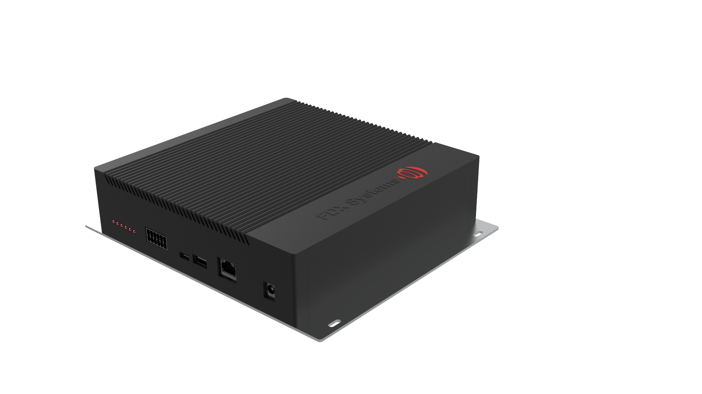
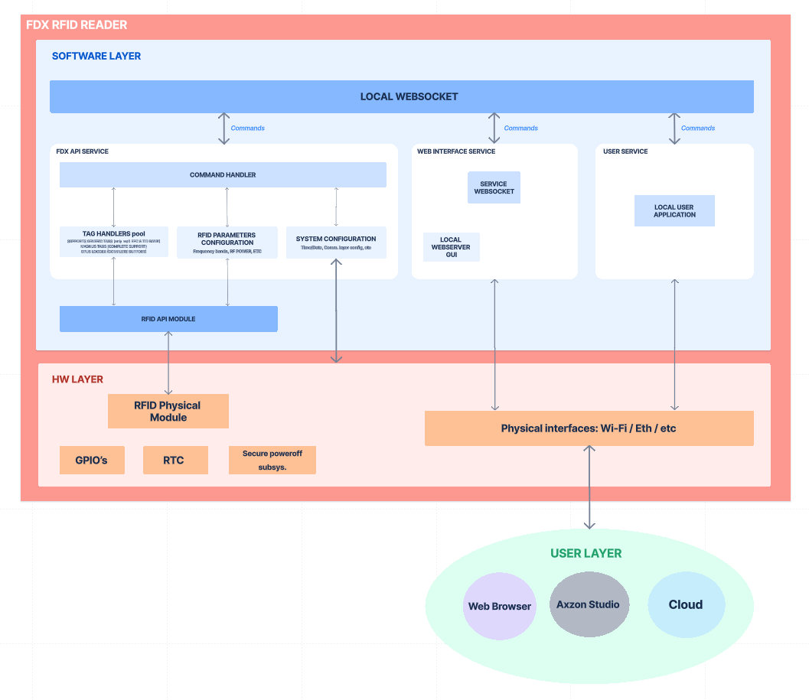

# Product Description

## Hardware 
The hardware is composed by:
- Aluminum Enclosure for wall or table mounting 
- Power source options:
    - 12V DC Standard Jack
    - Ethernet (PoE)
- Support for peripherals and modules:
    - USB Type-A
    - USB Type-C (Debugging Console)
    - Isolated GPIO's:
        - 4 inputs
        - 4 outputs
    - 6 Signalling LED's
    - 10/100Mb Ethernet
    - Wi-Fi module
- 4 TNC Connectors (RFID Connectors)

  
  <em>RFID Reader Housing</em>

## Software 
### Firmware
The firmware consists of:
- OS: In-house tailored Embedded Linux distribution
- The API consists of two multithreaded services:
    - The FDX API Service
    - WebSocket service 

### General Firmware Block Diagram
The general block diagram of the system can be thought of as:

  
  <em>General Block Diagram</em>

The main distinctions we can mention are:
- The User layer interacts with the system through high level commands
- The FDX API Service handles all the low level complexity and hardware-related functionalities
- There are many physical interfaces through which the client can interact with the Reader

### Features
The software has the following features:

-  AxzonStudio compatibility
-  Network support and automated configuration for: Ethernet, Wi-Fi
-  High-level API
-  Out-of the box Embedded Web to configure and read RFID tags 
-  Cloud connectivity and functionalities 
-  Possibility of cross-compiling custom 
applications to be run on-board
-  OTA Firmware Updates  
-  Low-level API backward compatibility
